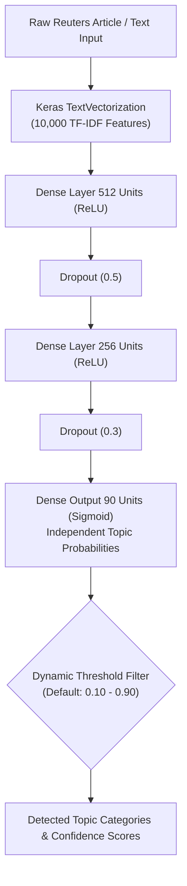

# 📰 Reuters-21578 Multi-Label Text Classification & Intelligence Platform

<p align="center">
  
  
  
  
  
  
  
</p>

<p align="center">
  <b>An end-to-end Deep Learning & NLP platform for multi-label classification of financial news streams from the benchmark Reuters-21578 dataset, equipped with a modern interactive intelligence dashboard and real-time REST API.</b>
</p>

---

## 📑 Table of Contents

- [📌 Project Overview](#-project-overview)
- [✨ Key Features](#-key-features)
- [🏗️ System Architecture](#️-system-architecture)
- [📊 Model Performance & Benchmarks](#-model-performance--benchmarks)
  - [Visualizations & Training Logs](#visualizations--training-logs)
- [🌐 Interactive Web Dashboard](#-interactive-web-dashboard)
- [🔌 REST API Reference](#-rest-api-reference)
- [⚡ Quickstart & Installation](#-quickstart--installation)
- [🧪 Model Training & Export](#-model-training--export)
- [📁 Project Structure](#-project-structure)
- [📚 Reuters-21578 Dataset Details](#-reuters-21578-dataset-details)
- [📜 License](#-license)

---

## 📌 Project Overview

Financial news articles routinely span multiple interrelated topics at once—for instance, an article describing quarterly corporate results may concurrently involve acquisitions, foreign currency exposure, and dividend declarations. Framing this challenge as a standard single-label classification introduces severe distortion and data loss.

This repository implements a **multi-label deep learning pipeline** using an Artificial Neural Network (ANN) trained on the benchmark **Reuters-21578** financial news corpus. It processes raw document files, extracts high-dimensional TF-IDF unigram features across a 10,000-word vocabulary, trains a regularized Multi-Layer Perceptron (MLP), and serves predictions through an interactive Flask dashboard with sub-millisecond inference latency.

---

## ✨ Key Features

- **🎯 Multi-Label Classification Head:** Employs 90 independent **Sigmoid** activation outputs paired with **Binary Cross-Entropy Loss**, allowing documents to simultaneously belong to zero, one, or several topics.
- **🔤 Vocabulary-Adapted TF-IDF:** Utilizes `tf.keras.layers.TextVectorization` with TF-IDF weighting across the top 10,000 vocabulary tokens to represent financial news articles with term weighting.
- **🛡️ Dropout Regularization:** Built with dual Dropout layers (0.5 and 0.3) to prevent overfitting on imbalanced categories and maintain generalization on test articles.
- **🖥️ Modern Web Dashboard:** A dark-themed responsive UI featuring real-time Chart.js probability bars, a dynamic confidence threshold slider (10%–90%), token count analytics, and pre-loaded Reuters test samples.
- **⚡ Real-Time REST API:** Clean JSON endpoints for automated inference (`/api/predict`), model metadata inspection (`/api/info`), metrics (`/api/metrics`), and test cases (`/api/samples`, `/api/random_test`).
- **📦 Pre-Trained Artifacts:** Includes exported Keras model (`reuters_ann_model.keras`), class dictionary, and precomputed vocabulary + IDF weights (`vocab.json`, `idf_weights.json`) for instant out-of-the-box evaluation without mandatory retraining or training corpus dependencies.

---

## 🏗️ System Architecture



### Layer Specifications

| Layer | Type | Output Shape | Parameters | Activation & Purpose |
| :--- | :--- | :--- | :--- | :--- |
| **Input** | `InputLayer` | `(None, 10000)` | 0 | TF-IDF Normalized Feature Vector |
| **Dense 1** | `Dense` | `(None, 512)` | 5,120,512 | ReLU activation |
| **Drop 1** | `Dropout` | `(None, 512)` | 0 | 50% neuron dropout rate |
| **Dense 2** | `Dense` | `(None, 256)` | 131,328 | ReLU activation |
| **Drop 2** | `Dropout` | `(None, 256)` | 0 | 30% neuron dropout rate |
| **Output** | `Dense` | `(None, 90)` | 23,130 | 90 independent **Sigmoids** |

**Total Trainable Parameters:** 5,274,970 (~20.1 MB)

---

## 📊 Model Performance & Benchmarks

The model was evaluated on the official **ModApte** test split of Reuters-21578:

| Metric | Training Set | Validation Set | Test Evaluation (ModApte) |
| :--- | :---: | :---: | :---: |
| **Document Count** | 7,769 | ~777 (10% split) | **3,019 documents** |
| **Micro F1-Score** | — | — | **85.30%** |
| **Exact-Match Accuracy** | **89.95%** | **79.79%** | **80.36%** |
| **Micro ROC-AUC Score** | **0.9710** | **0.9450** | **0.9770** |
| **Hamming Loss** | — | — | **0.00397** |
| **Total Target Categories** | 90 | 90 | **90 topics** |
| **Inference Latency** | — | — | **< 1.0 ms / doc** |

### Visualizations & Training Logs

#### 📂 Dataset Composition
<p align="center">
  
</p>

#### 📈 Training Progress (10 Epochs)
<p align="center">
  
  <br/><br/>
  
</p>

#### 📉 Loss & Accuracy Convergence Curves
<p align="center">
  
</p>

#### 🎯 Test Set Evaluation & Overall Metrics
<p align="center">
  
</p>

---

## 🌐 Interactive Web Dashboard

The Flask web application provides a browser-based UI for interacting with the neural classifier:

1. **Live Inference Console:** Type or paste raw financial news. Features a real-time character & token counter.
2. **Interactive Probability Breakdown:** Dynamic horizontal bar charts (powered by Chart.js) illustrating confidence percentages across top detected categories.
3. **Threshold Sensitivity Slider:** Tune the classification boundary on the fly between `0.10` and `0.90` to observe precision-recall trade-offs.
4. **Curated Benchmark News:** One-click presets for common Reuters scenarios:
   - 📈 *Corporate Earnings & Dividends* (`earn`)
   - 🤝 *Mergers, Buyouts & Acquisitions* (`acq`)
   - 🛢️ *OPEC Crude Oil & Energy Reserves* (`crude`)
   - 💱 *Central Bank FX Intervention & Interest Rates* (`money-fx`, `interest`)
   - 🌾 *Agricultural Grain Exports* (`grain`, `wheat`)
5. **Topic Catalog (90 Categories):** Search and explore all 90 supported financial classes with detailed taxonomy.

---

## 🔌 REST API Reference

### 1. Predict Categories
**Endpoint:** `POST /api/predict`  
**Content-Type:** `application/json`

#### Request Payload:
```json
{
  "text": "Exxon Mobil announced first-quarter profits rose 18% following higher crude oil benchmarks and expanding refinery margins.",
  "threshold": 0.35
}
```

#### Response:
```json
{
  "predictions": [
    {
      "category": "earn",
      "probability": 0.9624,
      "percentage": 96.24,
      "selected": true
    },
    {
      "category": "crude",
      "probability": 0.8841,
      "percentage": 88.41,
      "selected": true
    }
  ],
  "top_candidates": [ ... ],
  "all_candidates": [ ... ],
  "threshold": 0.35,
  "latency_ms": 1.25,
  "word_count": 18,
  "tokens": ["exxon", "mobil", "announced", "profits", "crude"]
}
```

### 2. Model Metadata & Status
**Endpoint:** `GET /api/info`  
Returns system status, active class list, vocabulary dimension, total parameters, and training history.

### 3. Model Empirical Metrics
**Endpoint:** `GET /api/metrics`  
Returns computed test evaluation metrics (`micro_f1`, `exact_match_acc`, `micro_roc_auc`, `hamming_loss`, `precision`, `recall`, etc.) and training epoch curves.

### 4. Load Sample Test Case
**Endpoint:** `GET /api/samples`  
Fetches curated Reuters sample articles with expected ground-truth labels for quick verification.

### 5. Random Test Document
**Endpoint:** `GET /api/random_test`  
Fetches a random document from the ModApte test set with its assigned ground-truth topics.

---

## ⚡ Quickstart & Installation

### Prerequisites
- Python **3.10+** (tested on Python 3.12)
- Git & Git LFS (recommended)

### 1. Clone the Repository
```bash
git clone https://github.com/sekharjadeja/Reuters_ANN.git
cd Reuters_ANN
```

### 2. Set Up Virtual Environment
```bash
# Windows
python -m venv .venv
.venv\Scripts\activate

# Linux / macOS
python3 -m venv .venv
source .venv/bin/activate
```

### 3. Install Dependencies
```bash
pip install -r requirements.txt
```

### 4. Launch the Web Application
```bash
python app.py
```
Open your browser and navigate to:
```
http://127.0.0.1:5000
```
> **Note:** The application starts instantly using pre-trained artifacts (`model_artifacts/reuters_ann_model.keras`, `vocab.json`, `idf_weights.json`). If test documents are requested via `/api/random_test`, `test.zip` will be automatically unpacked if not already extracted.

---

## 🧪 Model Training & Export

If you wish to re-train the model or modify hyperparameters:

```bash
python train_and_export.py
```

This script will:
1. Auto-extract `training.zip` and `test.zip` if directories are missing.
2. Parse category mappings from `cats.txt`.
3. Compute TF-IDF representations (10,000 vocabulary tokens) and extract IDF weights.
4. Train the neural network for 10 epochs.
5. Formally evaluate on the 3,019 test set documents to calculate Micro/Macro F1, ROC-AUC, Hamming Loss, and Exact-Match Accuracy.
6. Export the trained model and complete artifacts into `model_artifacts/`:
   - `reuters_ann_model.keras` — Full Keras serialized model weights and architecture.
   - `metadata.json` — Class list, label encoding, training history, and empirical test metrics.
   - `vocab.json` — TF-IDF vocabulary dictionary.
   - `idf_weights.json` — Precomputed IDF weights for zero-adaptation instant startup.

---

## 📁 Project Structure

```text
Reuters_ANN/
├── model_artifacts/               # Exported trained models and metadata
│   ├── metadata.json              # 90 topic classes, training history, and test metrics
│   ├── reuters_ann_model.keras    # Saved Keras neural network (~60 MB)
│   ├── vocab.json                 # Adapted TF-IDF token dictionary
│   └── idf_weights.json           # Precomputed IDF weights array
├── static/                        # Frontend UI assets
│   ├── app.js                     # Dynamic threshold filtering, Chart.js, async API calls
│   └── style.css                  # Dark-mode styling, glassmorphism, responsive grid
├── templates/
│   └── index.html                 # Main dashboard interface
├── cats.txt                       # Reuters-21578 document ID to topic mapping
├── test.zip                       # 3,019 test documents (ModApte split, auto-extracted if needed)
├── training.zip                   # 7,769 training documents (ModApte split, auto-extracted if needed)
├── app.py                         # Flask web application & REST API server
├── train_and_export.py            # Automated training, evaluation & artifact exporter
├── requirements.txt               # Pinned Python package dependencies
├── .gitignore                     # Git exclusion rules (.venv, .idea, test/, training/)
└── README.md                      # Comprehensive project documentation
```

---

## 📚 Reuters-21578 Dataset Details

The **Reuters-21578** benchmark is a widely used standard test collection in NLP and information retrieval:
- **Corpus Source:** Financial news stories appearing on the Reuters newswire in 1987.
- **Split Scheme:** **ModApte** split (eliminates unlabelled articles and guarantees strict separation between training and test sets).
- **Target Topics:** 90 economic and financial classes including commodities (*grain, crude, gold, cocoa*), macroeconomic indicators (*interest, cpi, gnp, jobs*), and corporate transactions (*earn, acq*).
- **Label Distribution:** Highly skewed, multi-label distribution reflecting natural real-world financial reporting.

---

## 📜 License

This project is open-source and available under the [MIT License](LICENSE).